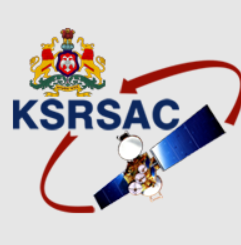

---
hide:
  - toc
  - navigation
---

# Experience & Education

## Work Experience

### GIS Analyst — Skylark Drones
*September 2024 – Present | Bengaluru, India*

- Process UAV and LiDAR datasets including point-cloud classification, noise filtering, DSM/DTM generation, and terrain modelling for infrastructure and mining projects.
- Perform solar panel defect detection using high-resolution drone imagery and spatial analytics workflows.
- Automate geospatial workflows using QGIS Model Builder and Python to streamline reprojection, spatial indexing, geometry extraction, and reporting.
- Support Railway KAVACH geospatial analysis including track alignment validation, spatial referencing, and GIS dataset preparation.
- Perform spatial QA/QC, coordinate transformation, attribute validation, and geodatabase management for MCDR compliance.

### GIS Intern — Skylark Drones
*March 2024 – September 2024 | Bengaluru, India*

- Conducted rooftop solar suitability analysis using slope, aspect, shadow modelling, and proximity parameters.
- Supported drone imagery preprocessing, orthomosaic generation, and DEM production.
- Performed solar defect detection analysis using geospatial data processing techniques.

### Project Associate — Karnataka State Remote Sensing Applications Centre
*August 2023 – February 2024 | Karnataka, India*

- Worked on the Karnataka Revenue HISSA Boundary Updation Project using cadastral digitization and georeferencing.
- Performed spatial validation, topology checks, and boundary corrections for land records datasets.

---

## Education

### M.Tech in Geoinformatics
**Karnataka State Remote Sensing Applications Centre** | *2023*

Graduated with a CGPA of 9.23.

---

### B.E in Civil Engineering
**Dayananda Sagar College of Engineering** | *2023*

Graduated with a CGPA of 8.18.

---

## Certifications

- GATE 2023 – Geomatics Engineering — IITK/IISE, 2023 *(All India Rank 103)* — [View Scorecard](assets/C366Z86ScoreCard%20(1).pdf){ target="_blank" }
- Going Places with Spatial Analysis — ESRI MOOC
- Spatial Data Science - ESRI MOOC
- GIS for Climate Action - ESRI MOOC
