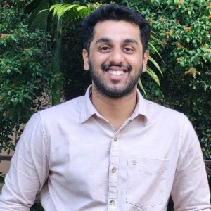
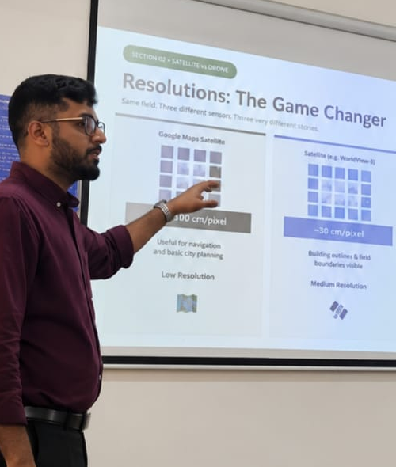

---
hide:
  - toc
  - navigation
---
<!--
CHECKLIST FOR THIS PAGE:
- [ ] Replace [YOUR NAME] with your full name (3 places)
- [ ] Replace [YOUR JOB TITLE] with your current or target role
- [ ] Replace [YOUR TAGLINE] with a short phrase describing your focus
- [ ] Rewrite the About Me paragraph with your own words
- [ ] Replace assets/images/profile.png with your actual photo (keep the filename or update it below)
- [ ] Replace assets/images/about.png with your own image (a field photo, map, or workspace shot)
- [ ] Edit the skill cards to match your actual skills (add, remove, or rename cards as needed)
- [ ] Update GitHub and LinkedIn links in the Connect section
- [ ] Add your CV PDF to docs/assets/ and update the filename in the Download CV button
-->

  

  

  
  <h1>YASHAS RAMESH</h1>
  
<strong>GIS ENGINEER</strong>

  
<em>GIS | Remote Sensing | UAV | LiDAR | Python</em>

---

## About Me

I am a GIS and Geospatial Engineer with experience in remote sensing, UAV photogrammetry,
LiDAR processing, and geospatial data analysis. My work involves transforming satellite,
aerial, and field datasets into practical outputs for mapping, planning, and decision-making.

I have worked with ArcGIS Pro, QGIS, Google Earth Engine, and Python tools such as GeoPandas,
Rasterio, Pandas, and NumPy for spatial analysis and automation. I also have hands-on experience
in processing drone imagery, point clouds, and raster datasets for environmental and infrastructure
applications.

My interest lies in combining geospatial science, data-driven workflows, and practical problem
solving to support sustainable land and resource management. I am especially motivated by projects
that connect data, technology, and field realities.

  

---

[View My Projects :material-arrow-right:](projects/index.md){ .md-button .md-button--primary }
[Download CV :material-download:](assets/Yashas-CV.pdf){ .md-button }

---

## Skills

-   :material-layers:{ .lg .middle } **GIS & Remote Sensing**

    ---

    - QGIS, ArcGIS Pro, Google Earth Engine
    - GDAL / OGR, GRASS GIS
    

-   :material-code-braces:{ .lg .middle } **Programming**

    ---

    - Python — GeoPandas, NumPy, Pandas
    - SQL, PostgreSQL + PostGIS

-   :material-database:{ .lg .middle } **Data & Cloud**

    ---

    - PostgreSQL + PostGIS
    - Data formats: GeoJSON, GeoTIFF, NetCDF

-   :material-airplane:{ .lg .middle } **Drone / UAV Data Processing**

    - Mission planning and flight operations
    - Photogrammetry: Agisoft Metashape, OpenDroneMap
    - Point cloud processing: CloudCompare, PDAL

-   :material-airplane:{ .lg .middle } **LiDAR Data Processing**

    - Pre-Processing: DJI Terra
    - Post-Processing: Spatix
    - LiPowerline

---

## Connect

[GitHub](https://github.com/YashasRamesh8
){ .md-button }
[LinkedIn](https://linkedin.com/in/YashasRamesh){ .md-button }
