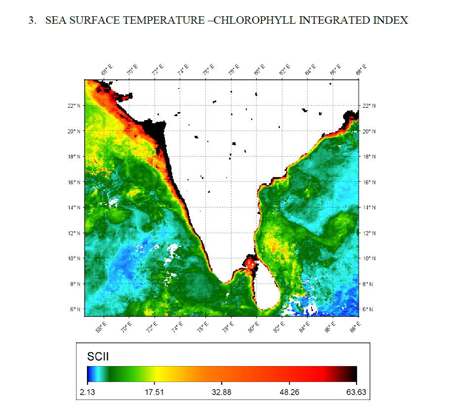

<!--
CHECKLIST FOR THIS PAGE (copy this file for each new project):
- [ ] Replace [YOUR PROJECT TITLE] with your project title
- [ ] Replace the hero image with your own (add to docs/assets/images/)
- [ ] Update the Overview section
- [ ] Update the Methods & Tools section
- [ ] Update the Key Findings section
- [ ] Update the Links section
- [ ] Add a card for this project on docs/projects/index.md
- [ ] Add a nav entry in mkdocs.yml
-->

# Potential Fishing Zone (PFZ) Mapping Along the Indian Coast

**Category:** M.Tech Mini Project (Team Project) | **Institution:** Karnataka State Remote Sensing Applications Centre (KSRSAC), VTU-EC | **Year:** 2023

---

## Objectives

- To apply satellite-derived Sea Surface Temperature (SST) and Chlorophyll-a data together in mapping potential marine fishing zones along the Indian coast.
- To develop an index for identifying the most favorable locations for fishing.
- To validate the derived Potential Fishing Zone (PFZ) maps against INCOIS fishery forecast data.

---

## Key Results & Findings

Level-1 and Level-3 Chlorophyll-a and SST data for September 2022–January 2023 were obtained from NASA Ocean Color and pre-processed using SeaDAS (atmospheric and radiometric correction, resampling, and subsetting). Since temperature variation across months along the Indian coast was found to have low separability for standard PFZ grading, a custom index — the **SST-Chlorophyll Integrated Index (SCII)** — was developed by taking the product of SST and Chlorophyll-a, tailored specifically to Indian coast dynamics. A union of the corrected SST (24°C–27°C) and Chlorophyll-a (>0.2 mg/m³) layers was used to generate the PFZ maps for each month.

### SCII Variation by Month

| Month | Min SCII | Max SCII |
|---|---|---|
| September | 1.45 | 95.81 |
| October | 1.79 | 109.21 |
| November | 1.64 | 72.35 |
| December | 2.264 | 82.89 |
| January | 2.13 | 63.63 |

Monthly analysis showed that the western tip of South India and the waters around Andaman & Nicobar formed strong PFZs in September, while October and November saw fishing zones spread further offshore as SST rose. December showed a higher concentration of potential zones near the Gujarat coast and southern Bay of Bengal, and **January emerged as the most favorable month overall**, with both SST and Chlorophyll-a falling within ideal ranges along most of the coast.

The derived PFZ map was validated against INCOIS Potential Fishing Zone advisory (sea-truth) data for the Karnataka coast for January 2023. Of 25 reference points, 18 matched the predicted zones, yielding **72% agreement** with INCOIS forecasts — confirming the reliability of the SCII-based approach while also indicating that additional parameters (e.g., bathymetry, ocean currents) could further improve accuracy.

---

## Tools & Technologies Used

- **Remote Sensing Data:** MODIS-Aqua (Level-1 & Level-3 SST and Chlorophyll-a, 4.6 km resolution)
- **Processing Software:** SeaDAS (NASA) — atmospheric correction, radiometric correction, resampling, subsetting
- **Data Sources:** NASA Ocean Color, INCOIS Potential Fishing Zone Advisory (validation/ground truth)
- **Custom Index:** SST-Chlorophyll Integrated Index (SCII)
- **Infrastructure:** Docker (Linux environment for SeaDAS processing)
- **Validation Method:** Point-based comparison against INCOIS sea-truth forecast data
