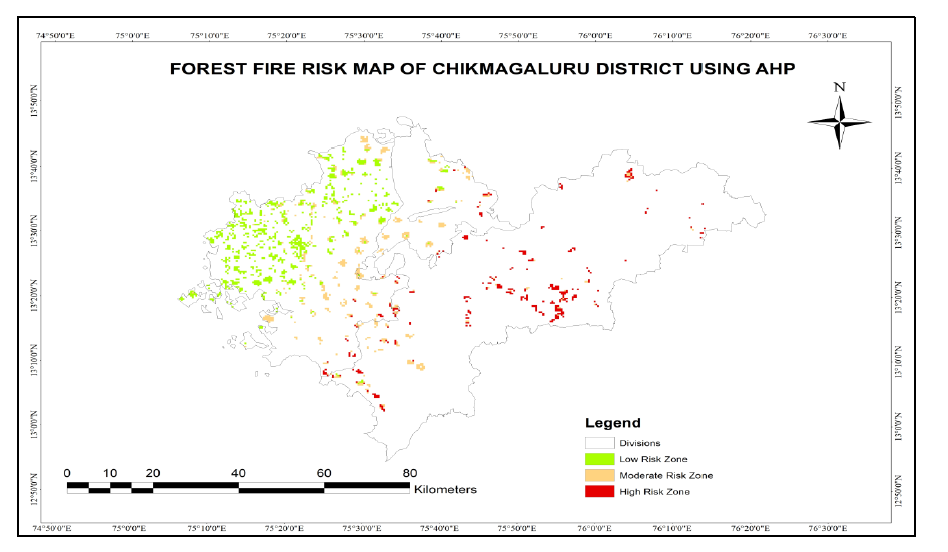
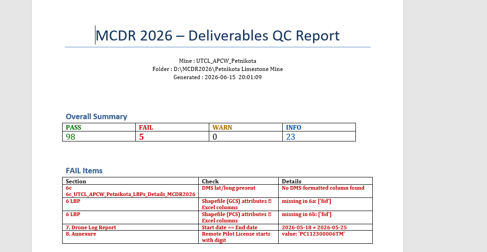
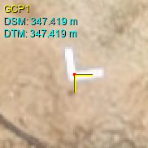
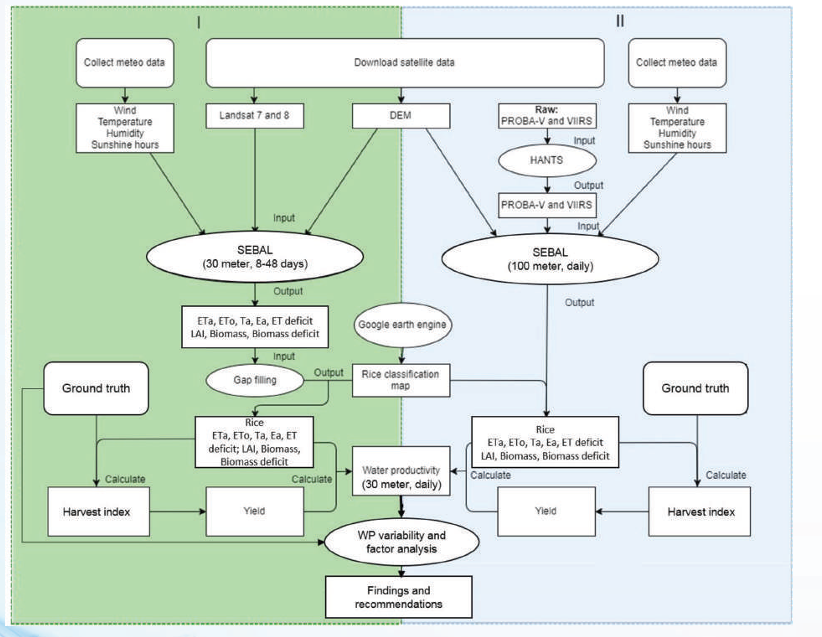
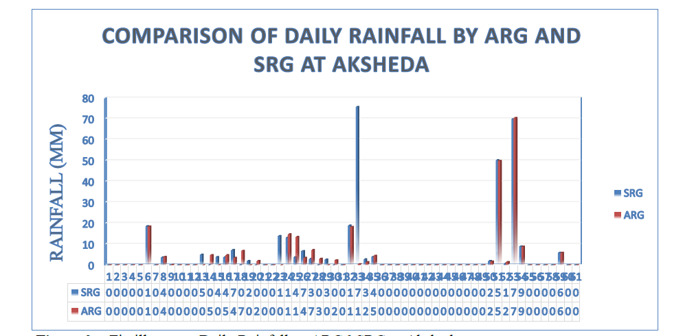

---
hide:
  - toc
  - navigation
---
<!--
CHECKLIST FOR THIS PAGE:
- [ ] Replace the two placeholder cards (marked [YOUR PROJECT ...]) with your real projects
- [ ] For each project: add a thumbnail image to docs/assets/images/ and update the path below
- [ ] For each project: create a project page by copying sample-project.md
- [ ] For each project: add a nav entry in mkdocs.yml (see the comments there)
- [ ] Delete placeholder cards you don't need yet
-->

# Projects

A selection of my geospatial projects. Click any card to see the full write-up.

**[Forest Fire Risk Zonation – Chikmagaluru District](FFRD_Chikmagaluru.md)**

Built a forest fire risk zoning model for Chikmagaluru using remote sensing, terrain, climate, and land-use data to map vulnerable areas and support mitigation planning.

`ArcGIS` `QGIS` `Google Earth Engine` `Python`

[View Project →](FFRD_Chikmagaluru.md){ .md-button }

**[Potential Fishing Zone (PFZ) Mapping](PFZ_MiniProject.md)**

Mapped PFZs along the Indian coast using SST and Chlorophyll-a data, then validated the outputs against INCOIS advisory information.

`Remote Sensing` `SeaDAS` `MODIS` `Python`

[View Project →](PFZ_MiniProject.md){ .md-button }

**[MCDR 2026 QC Checker](MCDR2026_QC_Checklist.ipynb)**

Built an automated QC workflow for MCDR 2026 deliverables to validate raster metadata, shapefiles, RMSE outputs, drone logs, and annexure consistency.

`Python` `GeoPandas` `Rasterio` `pandas`

[Open Notebook →](MCDR2026_QC_Checklist.ipynb){ .md-button }

**[GCP Workflow Notebook](GCPs_IBM_deliverables_workflow.ipynb)**

Explains the end-to-end process for converting GCP/PGCP inputs into geographic coordinates, derived fields, and output deliverables.

`Python` `GeoPandas` `PyProj` `pandas`

[Open Notebook →](GCPs_IBM_deliverables_workflow.ipynb){ .md-button }

**[Crop-Water Productivity – Tungabhadra Left Bank Canal](Crop_Productivity.md)**

Estimated spatially explicit actual evapotranspiration and water productivity for the Tungabhadra Left Bank Canal command area using PySEBAL, Landsat, GLDAS, and HiHydroSoil data.

`PySEBAL` `Landsat` `GLDAS` `Google Earth Engine` `QGIS` `Python`

[View Project →](Crop_Productivity.md){ .md-button }

**[Rainfall Data Validation & GIS Mapping – Tungabhadra](Rainfall_Data_Validation.md)**

Applied ACIWRM's data validation framework to compare Standard and Autographic Rain Gauge records, and geo-referenced raingauge station data for the Tungabhadra basin in QGIS and ArcGIS.

`QGIS` `ArcGIS` `IMD Data` `Hydrology`

[View Project →](Rainfall_Data_Validation.md){ .md-button }

