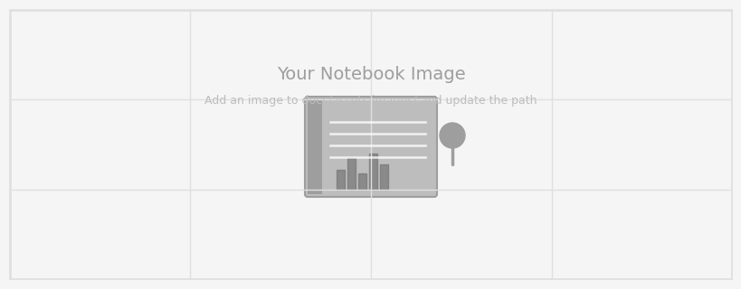

<!--
CHECKLIST FOR THIS PAGE:
- [ ] Replace the title and project details
- [ ] Replace the hero image with your own (add to docs/assets/images/)
- [ ] Update the Overview section
- [ ] Update the Methods & Tools section
- [ ] Update the Setup/Data/Analysis sections
- [ ] Update the Key Findings section
- [ ] Add a card for this project on docs/projects/index.md
- [ ] Add a nav entry in mkdocs.yml
-->



# Sample Notebook Project

**Category:** Sample Project | **Institution:** [Institution Name] | **Year:** [Year]

---

## Overview

An example notebook-style project page that mirrors the original sample notebook layout. This template is useful when you want to present a workflow, analysis steps, tools, and findings in a clean markdown format instead of a raw notebook.

- **Study Area:** [Region or extent]
- **Duration:** [Start month/year – End month/year]
- **Role:** [Solo project / Team lead / Contributor]
- **Status:** [Completed / In progress]

---

## Methods & Tools

### Data Sources

- [Dataset name and source]
- [Dataset name and source]
- [Additional dataset or API]

### Processing Steps

1. Load and clean raw data
2. Explore key variables and summary statistics
3. Create charts and spatial visualizations
4. Interpret results and document outcomes

### Tools Used

| Tool | Purpose |
|---|---|
| `Python` | Data analysis and automation |
| `pandas` | Data loading, cleaning, and aggregation |
| `matplotlib` | Static charts and visualization |
| `folium` | Interactive web maps |
| `GeoPandas` | Spatial data handling |

---

## Setup

```python
# Example setup block
import pandas as pd
import matplotlib.pyplot as plt
import folium
```

---

## Data

Placeholder dataset — replace with your own CSV, GeoJSON, or API call.

---

## Analysis

### Summary Statistics

```python
# Example analysis snippet
df = pd.read_csv("your_data.csv")
summary = df.describe()
print(summary)
```

### Trend Chart

```python
# Example plotting snippet
plt.figure(figsize=(10, 5))
plt.plot(df["month"], df["value"], marker="o")
plt.title("Trend over Time")
plt.show()
```

### Spatial Distribution

```python
# Example map snippet
m = folium.Map(location=[12.9716, 77.5946], zoom_start=10)
folium.Marker([12.9716, 77.5946], popup="Sample location").add_to(m)
m
```

---

## Key Findings

- [Finding one — include a number or metric if possible]
- [Finding two]
- [Finding three]

---

## Links

***
[View Code on GitHub](https://github.com/[YOUR-GITHUB-USERNAME]/[YOUR-REPO-NAME]){ .md-button }
[View Data Source](https://example.com){ .md-button }
***
